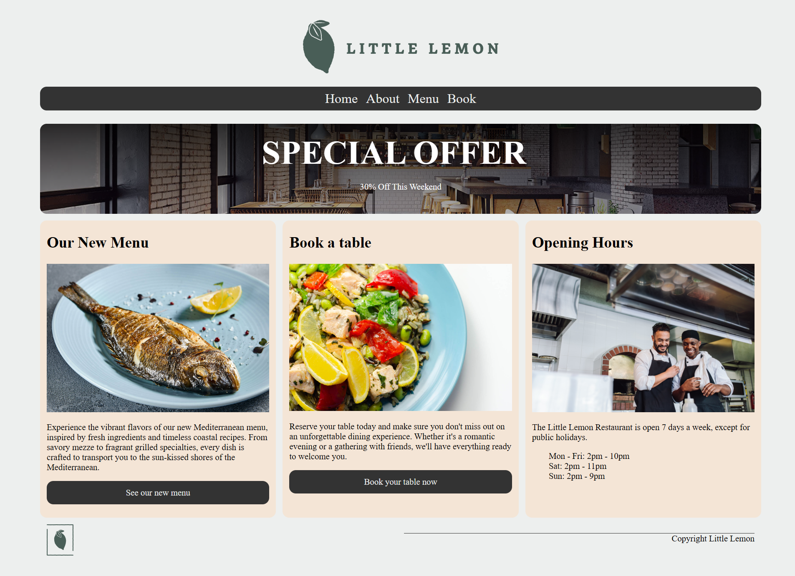

# Little Lemon Restaurant Web Application

## Overview

A React web app for the Little Lemon restaurant as per the Meta Frontend Developer Course. The web app contains an about page introducing the Little Lemon restaurant, a series of menu item pages describing the dishes available to order, and a booking page for reserving a table at the restaurant.



## Running the Application (Windows)

### Node Package Manager

Create a local [node js](https://nodejs.org/en/download) environment for the Little Lemon Web app using the [node package manager](https://docs.npmjs.com/downloading-and-installing-node-js-and-npm):


```
npm ci
```

Run the node tests and start the Little Lemon Web app using the following commands and the local node environment:

```
npm test
npm start
```

Once the web app is running, navigate to localhost:3000 in your preferred browser

* http://localhost:3000

### Docker

The latest version of the Little Lemon React Web App can be found as a [docker](https://www.docker.com/) image on dockerhub here:

* https://hub.docker.com/repository/docker/oislen/littlelemonreact/general

The image can be pulled from dockerhub using the following command:

```
docker pull oislen/littlelemonreact:latest
```

The Little Lemon React Web App can then be started using the following command and the docker image:

```
docker network create littlelemon
docker run --name llr --net littlelemon --publish 3000:3000 --memory 6GB --shm-size=512m --rm oislen/littlelemonreact:latest
```

Once the web app is running, navigate to localhost:3000 in your preferred browser

* http://localhost:3000
